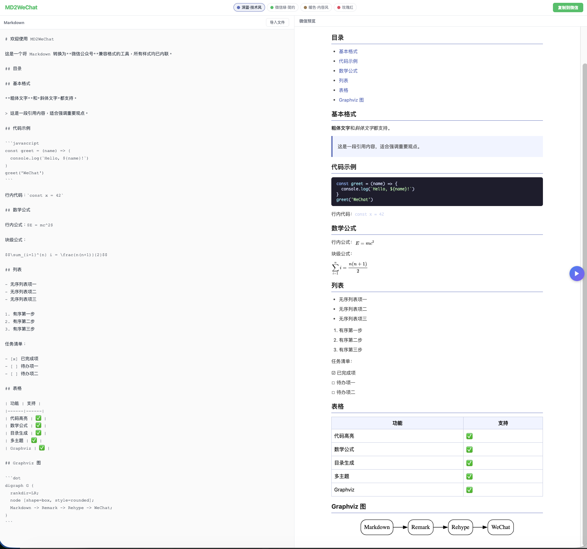

# MD2WeChat

把 Markdown 一键转成微信公众号编辑器可直接粘贴的富文本——所有样式内联，代码高亮、公式、Graphviz 图、表格、任务清单原样保留，粘进编辑器零返工。

🌐 **在线访问**：<https://pigtom.github.io/md-to-wechat/>

## 截图

> 把截图放到 `docs/` 下，按下面格式引用即可。



## 功能特性

- **实时预览**：左编辑、右预览，300ms 防抖刷新
- **一键复制到微信**：点「复制到微信」按钮，直接粘到公众号编辑器，富文本格式无丢失
- **多套主题**：深蓝技术风（默认）、微信绿、暖色内容风、玫瑰红
- **代码高亮**：基于 highlight.js，自动语言识别
- **数学公式**：行内 `$E=mc^2$` 与块级 `$$ … $$`，渲染为外链 SVG 图（绕开微信对 `<svg>` 的限制）
- **Graphviz / DOT 图**：` ```dot ` 代码块用 wasm 编译成 SVG 内嵌
- **GFM 扩展**：表格、删除线、自动链接、任务清单（`- [ ]` / `- [x]` 渲染为 ☐ / ☑ 不被微信打散）
- **目录**：标题 `## 目录` 处自动生成
- **缩进保护**：代码块行首缩进用 `&nbsp;` + `<br>` 编码，不依赖 WeChat 是否保留 `white-space:pre`

## 使用方式

1. 打开 <https://pigtom.github.io/md-to-wechat/>
2. 在左侧编辑 Markdown
3. 顶栏选主题
4. 点右上「复制到微信」
5. 在公众号编辑器里 `Cmd/Ctrl+V` 粘贴

## 本地开发

```bash
npm install
npm run dev      # 启动 dev server
npm test         # 跑 vitest
npm run build    # 类型检查 + 构建到 dist/
npm run lint
```

## 技术栈

- **React 19** + **Vite** + **TypeScript**
- **unified** / **remark** / **rehype** 流水线
- **rehype-katex**（按需加载，仅文档含 `$` 时拉取）
- **@viz-js/viz**（按需加载，仅文档含 dot 块时拉取 wasm）
- **rehype-highlight**、**remark-gfm**、**remark-math**、**remark-toc**

## 部署

`main` 分支推送后由 `.github/workflows/deploy.yml` 自动构建并发布到 GitHub Pages。

仓库 Settings → Pages → Source 需设为 **GitHub Actions**。
